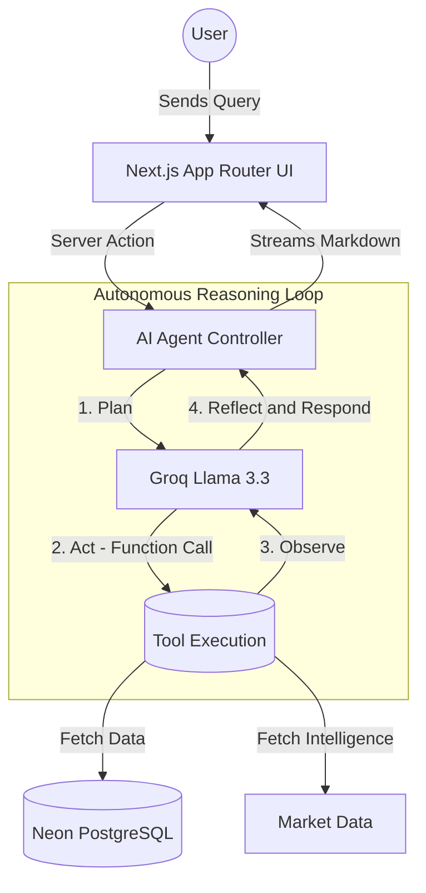

<div align="center">
  <br />
  <h1>🚀 Navix v2 - Agentic AI Career Coach</h1>
  <p>
    An enterprise-grade, autonomous AI career coaching platform. Navix uses a ReAct (Reasoning + Acting) Agent architecture to provide personalized career roadmaps, real-time salary intelligence, and ATS resume analysis.
  </p>
  <br />
</div>

<div align="center">
  
  
  
  
  
</div>

<br />

## 🌟 Key Features

*   **🤖 Autonomous AI Agent (ReAct Loop):** A multi-step reasoning agent that breaks down user career goals, uses specialized tools (market research, skill gap analysis), observes the results, and synthesizes an actionable response.
*   **🗺️ Dynamic Career Roadmaps:** Generates week-by-week learning plans tailored to the user's target role and current skill level.
*   **📊 Real-time Salary Intelligence:** Pulls active market data to display salary ranges (Min, Median, Max) and provides a personalized negotiation script.
*   **📄 ATS Resume Analyzer:** Instantly scores user resumes against industry-standard ATS algorithms, providing actionable feedback for improvement.
*   **🔄 Automated Background Jobs:** Utilizes **Inngest** for background processing, including cron jobs that automatically refresh stale industry insights on a weekly basis.

---

## 🏗️ System Architecture

Navix v2 implements a sophisticated Agentic architecture utilizing the ReAct (Reasoning and Acting) paradigm.



---

## 💡 Engineering Challenges & Lessons Learned

1.  **Orchestrating the ReAct Loop:** Handling tool-calling with an LLM can be brittle. I learned how to strictly type function schemas (using Zod) so the AI always returns precisely formatted JSON arguments, preventing application crashes during the reasoning phase.
2.  **Streaming UI Updates:** Waiting for a multi-step agent to finish thinking results in a poor UX. I implemented streaming responses so the user sees the agent's thought process (planning, calling tools, reflecting) in real-time, drastically reducing perceived latency.
3.  **Database Connection Pooling in Serverless:** Moving to Vercel Serverless Functions initially caused database connection exhaustion. I solved this by migrating to **Neon Postgres** and configuring Prisma to use edge-compatible connection pooling.

---

## ⚙️ Local Development Setup

### 1. Clone the repository
```bash
git clone https://github.com/tannu005/navix-v2.git
cd navix-v2
```

### 2. Install dependencies
*Ensure you are using Node.js v20+*
```bash
npm install --legacy-peer-deps
```

### 3. Configure Environment Variables
Create a `.env` file in the root directory:
```env
# Database (Neon Serverless Postgres)
DATABASE_URL="your_neon_db_url"

# Authentication (Clerk)
NEXT_PUBLIC_CLERK_PUBLISHABLE_KEY="your_publishable_key"
CLERK_SECRET_KEY="your_secret_key"
NEXT_PUBLIC_CLERK_SIGN_IN_URL=/sign-in
NEXT_PUBLIC_CLERK_SIGN_UP_URL=/sign-up
NEXT_PUBLIC_CLERK_AFTER_SIGN_IN_URL=/onboarding
NEXT_PUBLIC_CLERK_AFTER_SIGN_UP_URL=/onboarding

# AI Provider (Groq)
GROQ_API_KEY="your_groq_api_key"

# Background Jobs (Inngest)
INNGEST_EVENT_KEY="your_event_key"
INNGEST_SIGNING_KEY="your_signing_key"
```

### 4. Setup the Database
Push the Prisma schema to your database:
```bash
npx prisma db push
```

### 5. Start the Development Server
```bash
npm run dev
```
The application will be available at `http://localhost:3000`.

---

<div align="center">
  <i>Built with ❤️ by Tannu Yadav</i>
</div>
